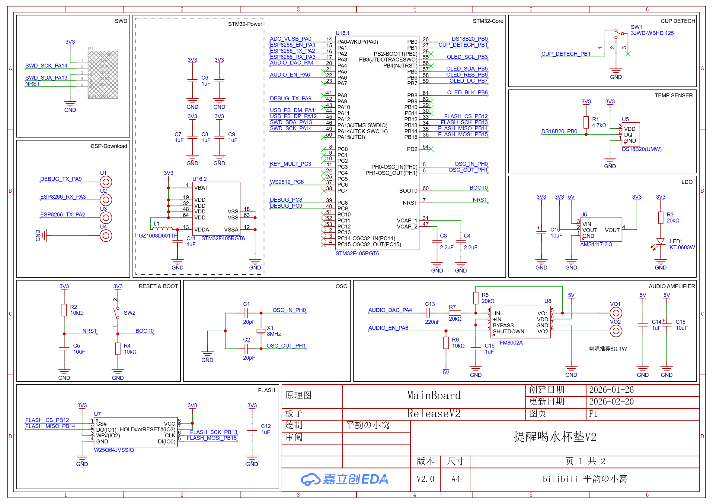
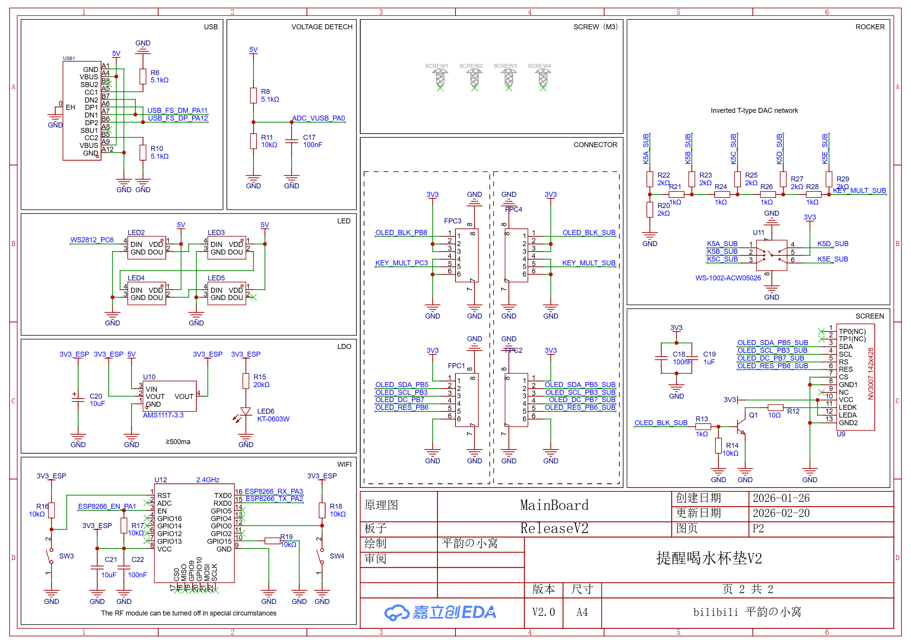

# 文件夹概览

- SCH：提醒喝水杯垫原理图
- PCB：提醒喝水杯垫PCB图以及交互式焊接BOM表

# 原理图说明
## 关键芯片选型
- MCU：STM32F405RGT6（192KB SRAM， 1MB Flash）
- 功放：FM8002A（DAC + DMA直推）
- 无线：ESP8266（UART）
- 存储：W25Q64JV（8MB SPI接口驱动）
- 屏幕：NV3007（142 * 428像素 SPI接口）
## 原理图

# PCB说明
推荐制作工艺：
- 两层板
- 板厚1.6mm
- 无需沉金工艺

## PCB 裸板

  
  

## PCB 原件贴装
推荐焊接顺序：
1. 所有正面贴片原件
2. 除屏幕外，所有背面贴片原件
3. 直插原件（DS18B20温度传感器，微动开关）
4. 屏幕（注意屏幕背面需粘贴双面胶，且双面胶不耐热）

  
  

# 版权
bilibili 平韵の小窝 原创作品

仅限个人学习使用，严禁无授权的商业用途！
