<!-- 这是一张图片，ocr 内容为： -->
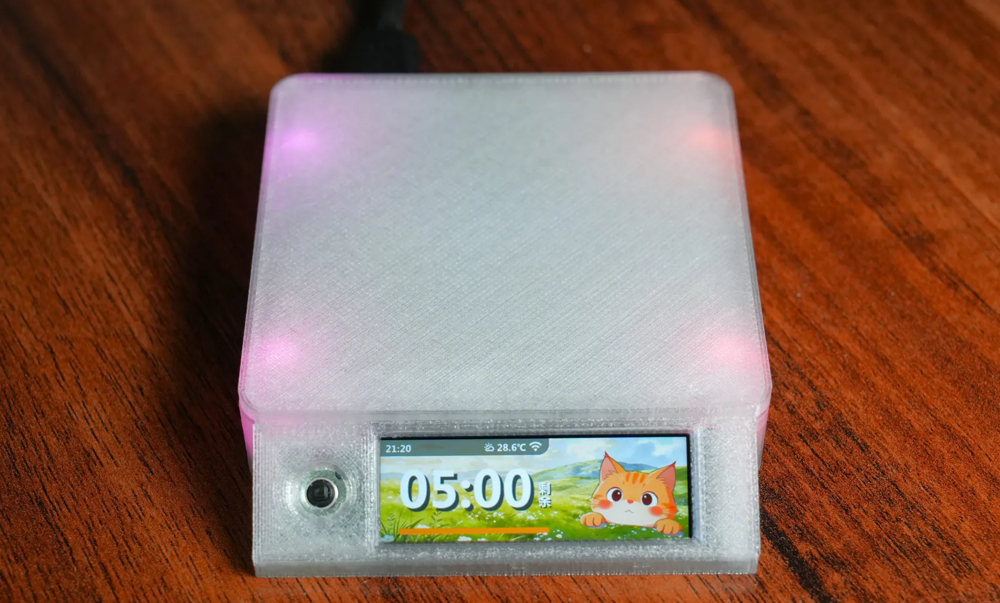

# 1、概览：
## 1.1、导览：
如果您拿到的是**成品杯垫**，直接查看章节1.概览、章节2开箱使用即可。无需查看其余章节。

如果您是电子爱好者，希望**从0开始动手制造**该杯垫，请阅读其余部分。

## 1.2、功能概览：
基础功能：

+ 放下水杯，杯垫自动进行一定时间倒计时，时间到，提醒用户喝水
+ 放下水杯、时间到了、拿走水杯 等语音播报
+ 可调节倒计时时间、灯光亮度、声音大小、灯光效果
+ 丰富的RGB灯光效果，支持 彩虹、蜡烛、星夜、纯白 四种灯效
+ 夜间模式，晚11点到早7点之间自动降低屏幕亮度和灯光亮度
+ 杯垫内集成温度传感器，可监测自身温度
+ 支持模拟U盘，可方便地更新语音文件（WAV文件）

wifi联网功能：

> 本杯垫集成了wifi功能，可连接网络，实现时间自动同步和天气信息自动同步
>

+ 可连接指定2.4G wifi网络（需通过U盘模式 在setting.txt中存入wifi名称和密码）
+ 可指定当前城市，支持拼音（需通过U盘模式 在setting.txt中存入城市，例如北京：beijing）
+ 可自动获取当前城市的天气，温度，湿度，以及未来两天的天气预报
+ 可自动获取网络时间（24小时制）
+ 语音拓展功能：
    - 可根据当前时间，自动连携播放时间语音（早、中、晚）
    - 可根据当前天气，自动连携播放天气语音（晴天、下雨、下雪）

# 2、开箱使用
## 2.1、外观介绍
+ 摇杆：可向上下左右拨动，以及向中心按下，共5个方向。具体含义如下：
    - 上下左右：灵活切换各界面，选择选项卡等
    - 中：选择
+ 彩色屏幕：
    - 可显示倒计时时间、天气预报、设置等
+ 水杯放置区域：
    - 用于放置水杯，可被水杯的重量轻微下压1mm。
    - **注意！**整体材料为3D打印材料，怕热，请勿让水杯放置区域温度高于50℃
+ USB-TypeC接口：
    - 杯垫不含电池，需通过该接口供电，推荐供电能力5V 1A
    - 该接口同时作为USB通讯接口，可将杯垫通过该接口+数据线连接电脑后，在杯垫设置中打开U盘模式，即可更新杯垫内wifi密码、语音等。

<!-- 这是一张图片，ocr 内容为： -->
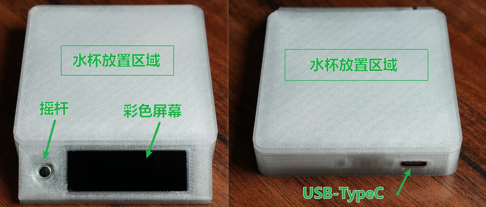

## 2.2、界面说明
### 2.2.1、开机自检界面
通过使用TYPE-C数据线连接USB-TypeC接口和电脑，杯垫屏幕点亮，并展示当前初始化进度：

<!-- 这是一张图片，ocr 内容为： -->

其中进度条展示当前开机进度，下方文字展示对应系统自检内容，如果进度条卡死，可根据下方自检内容判断故障原因。

### 2.2.2、主界面
自检完成后，进入主界面，可以看到如下信息：

> **注！标星号*项需要wifi联网使用**
>

+ 网络时间*：当前时间，可在连接wifi后自动通过网络获取
+ 夜间模式：用于指示当前杯垫是否处于夜间模式，该模式下屏幕和灯光亮度减弱
+ 天气信息*：该图标用于指示是否成功连接天气服务器，若成功连接，则该图标显示，否则隐藏
+ 杯垫温度：该温度由杯垫内部的温度传感器获取
+ wifi状态*：用于指示wifi是否成功连接，成功连接为白色，否则为黄色
+ 剩余时间进度条：用于指示剩余时间占总时间的比例
+ 剩余时间：用于显示剩余时间（格式  分钟：秒）
+ 杯垫状态：共三个表情包，分别对应 无水杯、水杯放下、时间到

<!-- 这是一张图片，ocr 内容为： -->
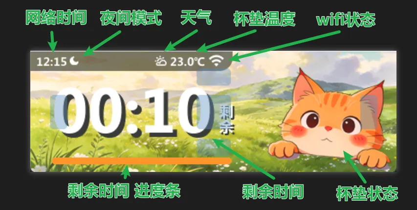

---

### 2.2.3、天气界面
在主界面下，可通过摇杆上划，进入天气界面：

> 注！该界面所有内容需联网使用
>

+ 当前城市*：中文显示城市名称，该中文名称由天气服务器返回
+ 今天、明天、后天：指示三天的日期，天气，温度范围，湿度

<!-- 这是一张图片，ocr 内容为： -->
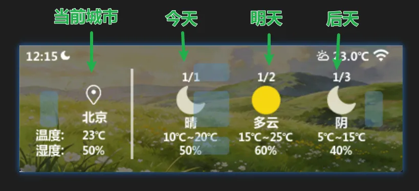

### 2.2.4、设置界面
在天气界面，继续上滑（或从主界面下滑，进入设置界面）：

设置界面中，可通过上下左右方向键选择需要的选项，并通过中键确定。左侧为标题，中间为具体选项，右侧为详细说明。

计时界面：

+ 可选择倒计时时间，当前固件支持如下6个常用时间

<!-- 这是一张图片，ocr 内容为： -->
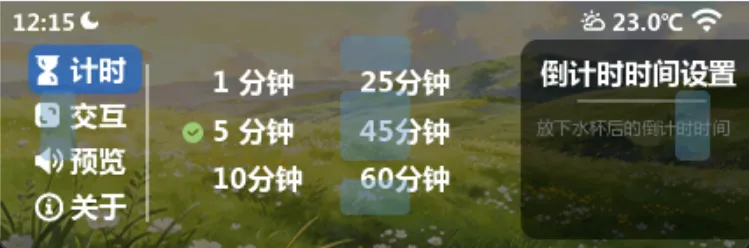

---

交互界面：

+ 可选择提示音大小
+ 可选择灯光亮度
+ 可选择灯光种类：
    - 虹：彩虹色效果，所有灯按彩虹色依次渐变过渡
    - 烛：模拟蜡烛效果，淡黄色灯光，亮度忽明忽暗
    - 星：星夜效果，4颗灯随机点亮，颜色随机
    - 白：纯白色效果，该模式灯光不闪烁。无动效

<!-- 这是一张图片，ocr 内容为： -->
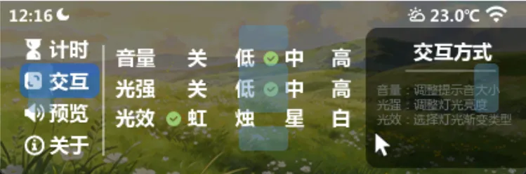

---

预览：

+ 用于预览存入杯垫内的音频文件，共有如下10种音频

<!-- 这是一张图片，ocr 内容为： -->
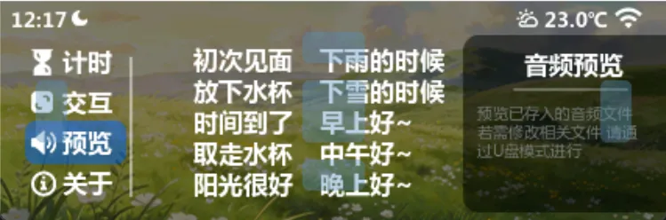

---

关于：

+ 可查看当前USB电压，若USB供电不足，会弹出相应提示框
+ JEDEC ID：为板载存储芯片的型号，用于辅助调试
+ WIFI IP：成功连接wifi后，显示杯垫的ip地址
+ 进度U盘 按钮：可将杯垫模拟成U盘，用于更新wifi信息等
+ 重置设备：谨慎操作！该选项会删除杯垫内所有数据（包括音频，字库等），用于杯垫发生极其严重的故障后使用。
+ 右侧 软件版本：显示当前程序的版本号，初始发行版本为V2.0。调试版本为V2.0 DEBUG
+ 右侧 编译时间：显示当前程序的编译时间，Feb 21 2026表示 编译于2026年2月21日

<!-- 这是一张图片，ocr 内容为： -->
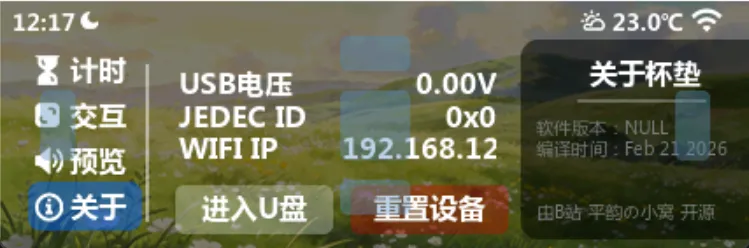

---

### 2.2.5、警告&错误
文件系统错误：

若初始化时进度条卡住，且弹出该提示框，表示内部存储芯片内文件损坏，5s后系统将进入U盘模式，可将必要文件拖入该U盘，待复制完成后，为杯垫断电，重新通电即可

<!-- 这是一张图片，ocr 内容为： -->

---

供电不足：

该提示框可能在任何时候弹出，一旦弹出，表示供电不足（系统会持续检测USB电压，在播放音频等大功耗工况时，可能导致USB电压过低，进而标记供电不足）。

推荐日常使用时，通过手机充电头供电，若使用电脑USB供电，且弹出该提示框，可适当降低音量或LED灯亮度。

<!-- 这是一张图片，ocr 内容为： -->

---

U盘模式提示：

在点击进入U盘按钮后，弹出该提示框。待提示框消失，即进入U盘模式（此时电脑应该会弹出 叮~ 的USB声音），同时杯垫屏幕、LED等均停止刷新。

在USB传输完成文件后，可在电脑上弹出U盘，之后推荐右滑摇杆，退出U盘模式。

注意！退出U盘模式后，建议断电 并重新上电，以使系统更新各类信息。

<!-- 这是一张图片，ocr 内容为： -->
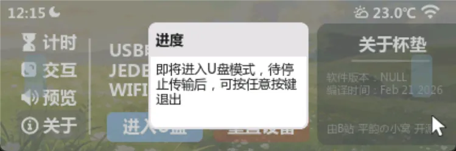

---

重置系统：

在点击重置设备按钮后，弹出该提示框。

<!-- 这是一张图片，ocr 内容为： -->
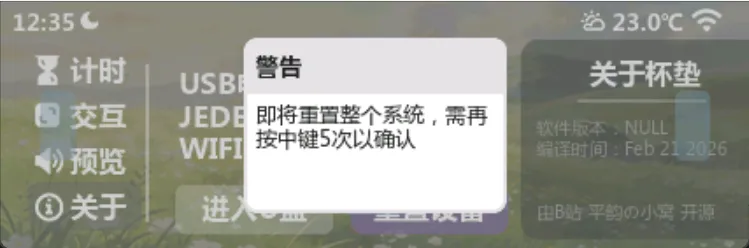

再次按5下中键，弹出第二个提示框，待该提示框消失，杯垫将删除所有用户文件（音频，配置信息等）

<!-- 这是一张图片，ocr 内容为： -->
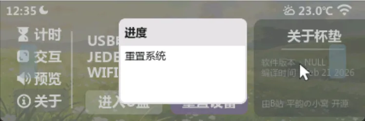

## 2.3、修改WIFI信息&连接网络
将杯垫通过USB线连接电脑，点击设置界面中 进入U盘按钮：

<!-- 这是一张图片，ocr 内容为： -->
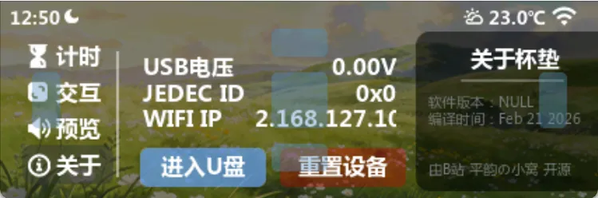

待提示框消失，打开电脑，可以看到多了一个U盘：

<!-- 这是一张图片，ocr 内容为： -->
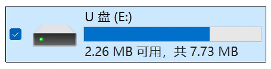

打开该U盘，可以看到如下内容：

<!-- 这是一张图片，ocr 内容为： -->
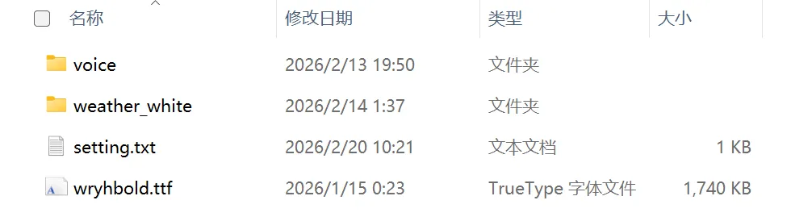

wifi信息等保存在setting.txt文件中，使用windows电脑自带的记事本打开该文件：

第一行为wifi名称，第二行为密码，第三行为城市名字

如下图所示，当前信息为：

+ wifi名称：TP-Link-1234
+ wifi密码：12345678
+ 城市名称：Beijing

<!-- 这是一张图片，ocr 内容为： -->
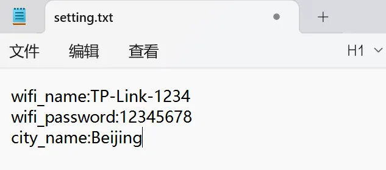

按需修改上述信息，

注意！

+ 请勿删除冒号:之前的字符！
+ 请保持每条信息均为新行，不可写到一行中！
+ wifi名称支持中文，需确保右下角编码格式为UTF-8编码

完成修改后，保存该setting.txt文件（可按键盘快捷吗Ctrl + S或记事本左上角 文件->保存）

保存后，从电脑端弹出U盘，为杯垫断电，重新通电，待重新开机，等待30秒左右，杯垫将成功连接wifi并更新天气信息。

# 3、复刻指南
本章节适用于从零制造的极客&电子爱好者，若您直接使用成品杯垫，可不看该章节。

## 3.1、获取工程
工程托管于GitHub：[https://github.com/pingyun001/SmartCupReminder-V2](https://github.com/pingyun001/SmartCupReminder-V2)

内含UI界面设计，硬件原理图，软件源码，机械结构等设计稿

推荐直接通过git克隆到本地即可。

如果电脑没有git环境，也可以直接下载压缩包：

<!-- 这是一张图片，ocr 内容为： -->
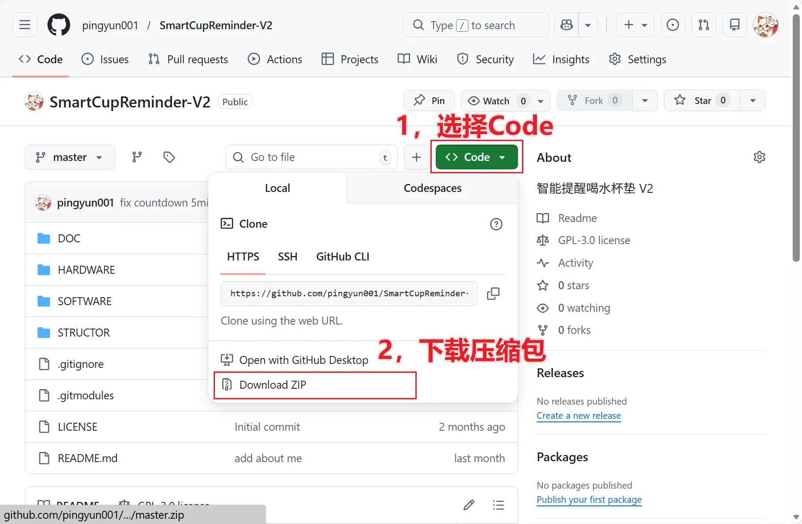

## 3.2、硬件焊接
> 默认您已经熟练掌握电路板下单，贴片元器件焊接等技能。
>

自行下单PCB板，注意板厚1.6mm，并完成焊接，焊接完成成品如下：

<!-- 这是一张图片，ocr 内容为： -->
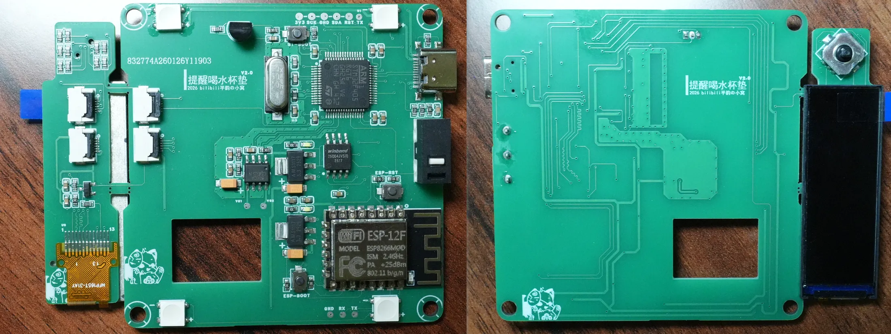

推荐优先焊接贴片原件，最后焊接屏幕。

屏幕焊接时，事先在屏幕背面贴好双面胶，并按如下方式对齐，粘贴后，弯折排线，完成焊接

<!-- 这是一张图片，ocr 内容为： -->
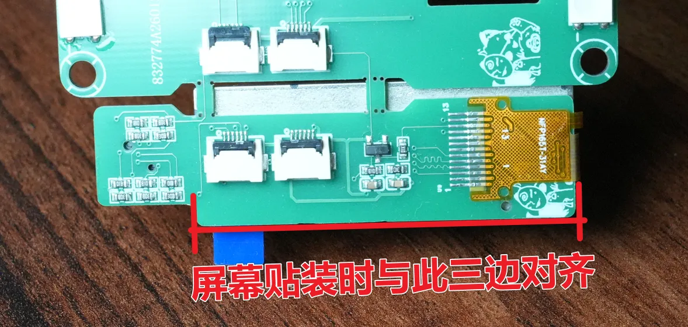

## 3.3、机械结构预组装
> 默认您已经熟练掌握3D打印，且有相关打印设备或条件
>

从工程中找到相关3D结构件并打印，共有三个结构件

> 位于路径：\SmartCupReminder-V2\STRUCTOR\打印件
>

推荐直接打印3MF后缀的三个文件<!-- 这是一张图片，ocr 内容为： -->
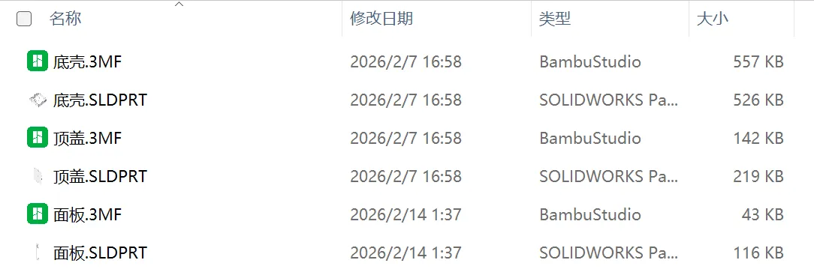

完成后如下：

<!-- 这是一张图片，ocr 内容为： -->
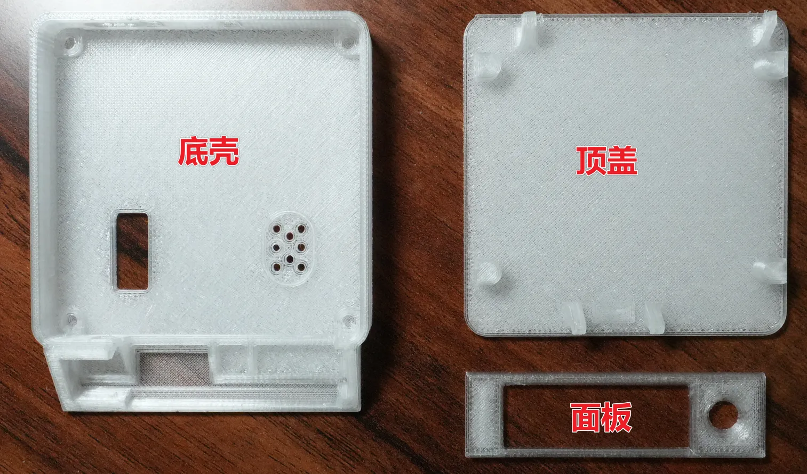

完成打印后，拆除必要的支撑，将PCB掰开（分离为底板和屏幕按键子板）后，

按如下步骤进行装配：

<!-- 这是一张图片，ocr 内容为： -->
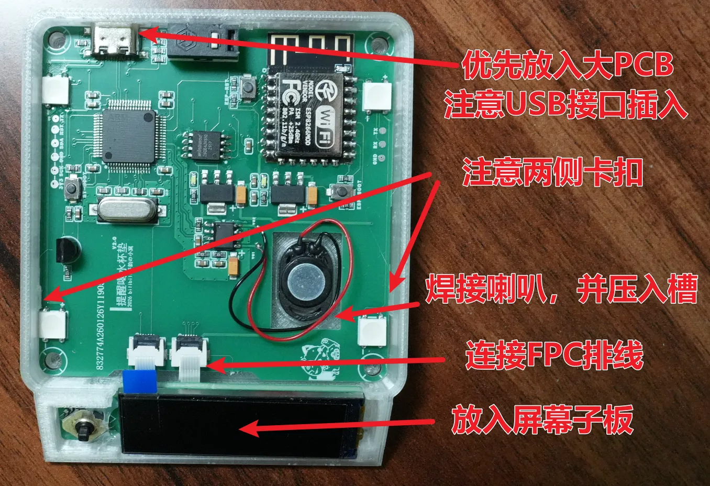

## 3.4、ESP8266固件下载
> 固件和源码均位于路径：SmartCupReminder-V2\SOFTWARE\ESP8266_WifiWeather
>

可通过传统arduino IDE下载，或通过ESP Tools下载，网上教程非常多，此次不过多介绍。

特别注意！建议使用CH340或CP2102等硬件USB转串口模块进行程序下载。不要使用ST-Link等软件模拟的串口。

按住ESP-BOOT后，为PCB上电，连接ESP下载串口，下载固件即可。

<!-- 这是一张图片，ocr 内容为： -->
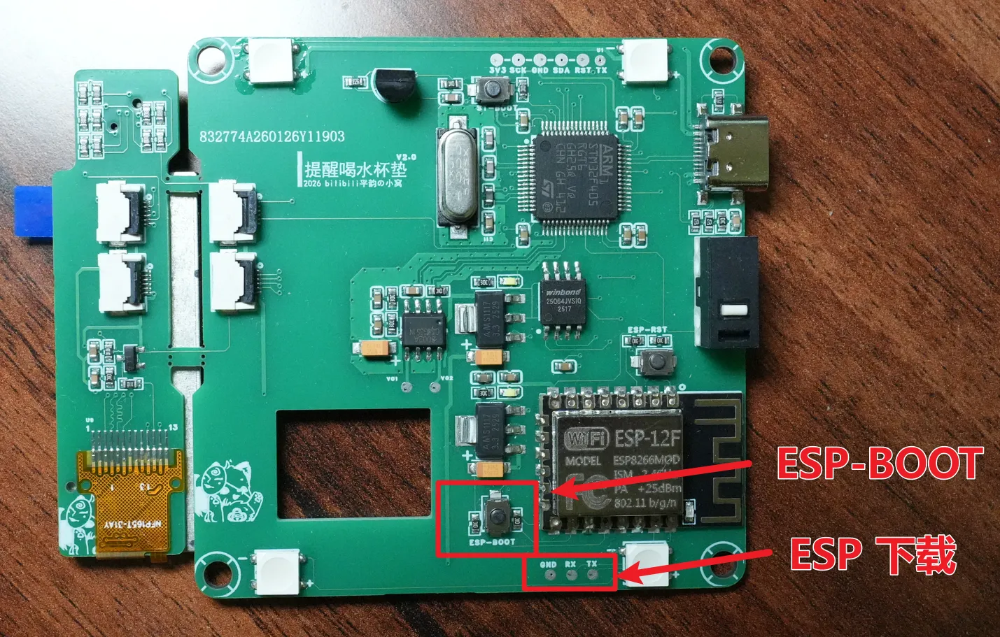

## 3.5、STM32固件烧录
推荐电脑安装STM32CubeProgrammer软件：

<!-- 这是一张图片，ocr 内容为： -->

并烧录固件Hex：

> 固件位于路径SmartCupReminder-V2\SOFTWARE\F405_CUP_MAT_V2\0-ReleaseHex
>

可选择V2.0或者V2.0_DEBUG两个Hex，前者为正式发行版，无调试信息，后者为调试版本，屏幕会显示帧率，内存占用，CPU使用率等，同时通过串口打印必要调试信息。

无特殊情况，推荐下载发行版。

<!-- 这是一张图片，ocr 内容为： -->
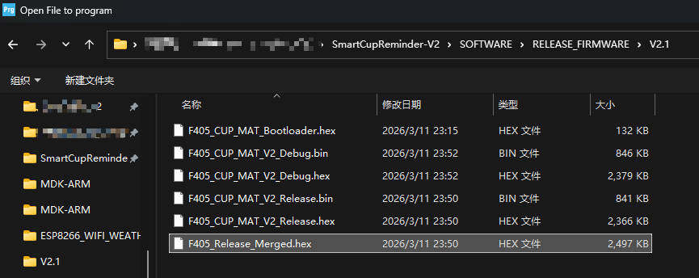

推荐使用USB数据线连接PCB板和CubeProgrammer软件，如下图，保持按住BOOT按钮，插入数据线到电脑

<!-- 这是一张图片，ocr 内容为： -->
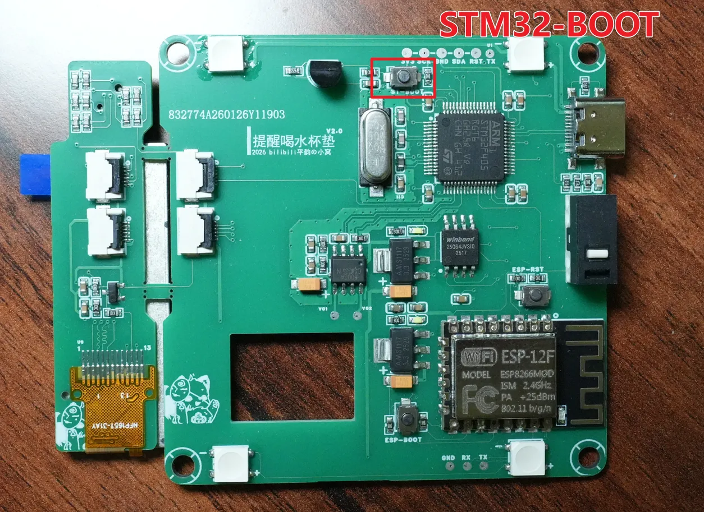

可以在CubeProgrammer软件中搜索到STM32芯片，搜索到后，点击连接按钮。

<!-- 这是一张图片，ocr 内容为： -->
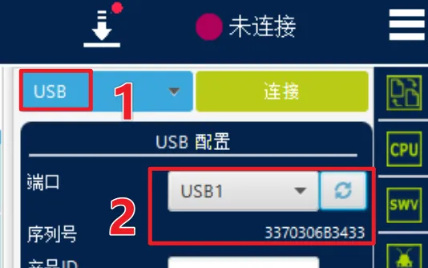

成功连接后，下图1处显示已连接，在2处选择上述Hex文件，并点3 开始烧录

<!-- 这是一张图片，ocr 内容为： -->
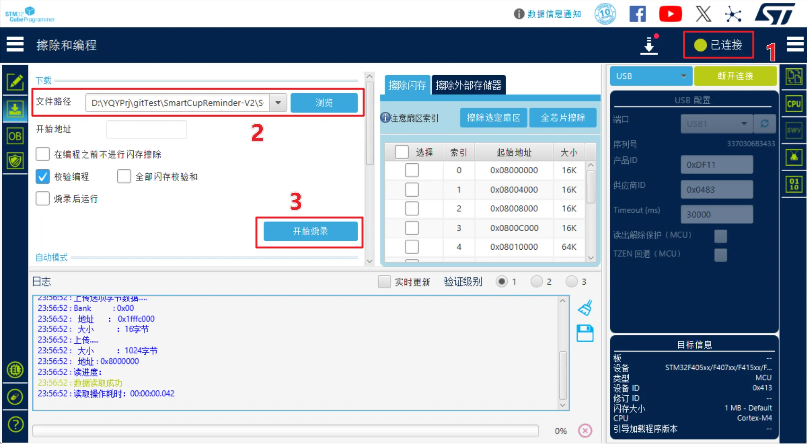

待进度条跑完即可。

如果USB方式无法下载，则需通过ST-Link、JLink等，通过SWD接口进行下载

> 由于STM32F4系列芯片的USB IP缺陷，以及板子USB焊接质量问题，可能有概率无法通过USB DFU连接（电脑弹出未识别的USB设备提示框），此时需要通过SWD接口下载程序
>

SWD接口位置如图，按线序连线即可，并连接板子，后续操作步骤同USB

<!-- 这是一张图片，ocr 内容为： -->
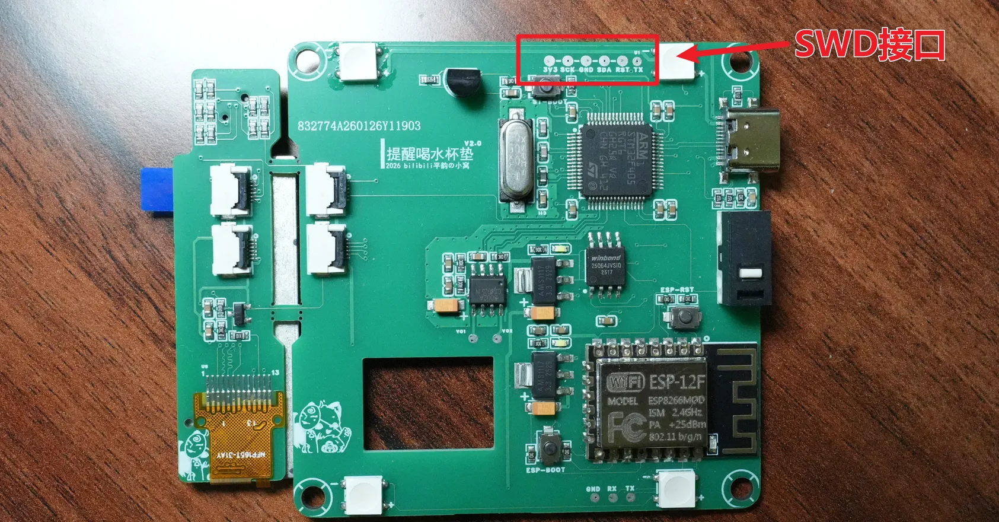

## 3.6、U盘文件下载
完成ESP8266和STM32固件烧录后，使用USB线连接杯垫和电脑，杯垫会进行开机自检，检测到文件缺失，会进行弹窗，并进入U盘模式

<!-- 这是一张图片，ocr 内容为： -->
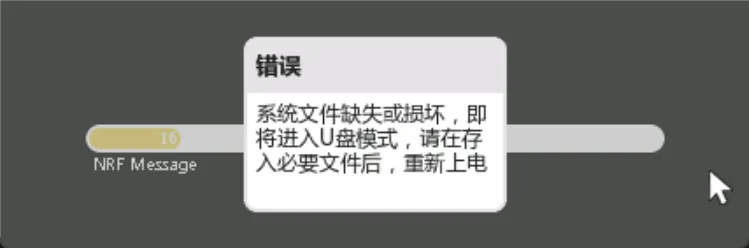

此时电脑上会识别到一个U盘，将必要的文件复制入U盘中：

> 位于路径：SmartCupReminder-V2\SOFTWARE\F4_UDISK_RESOURCES
>

该路径共有如下文件/文件夹，含义：

+ voice：必要的音频文件，格式为WAV
+ weather_white：天气小图标文件，用于天气界面的图片显示
+ setting.txt：用于保存wifi名称，wifi密码，城市位置
+ wryhbold.ttf：中文字体库文件，用于UI界面中的中文显示（城市名称等）

<!-- 这是一张图片，ocr 内容为： -->
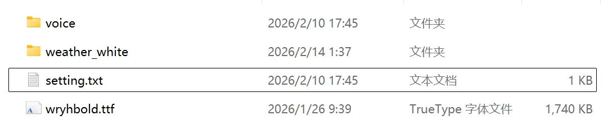

其中setting.txt中的内容需要根据自己的wifi名称进行修改，可参考2.3章节。

将这些文件/文件夹全部复制到U盘根目录，完成后，弹出U盘，断电，重新上电，等待自检完成。

成功进入主界面

<!-- 这是一张图片，ocr 内容为： -->
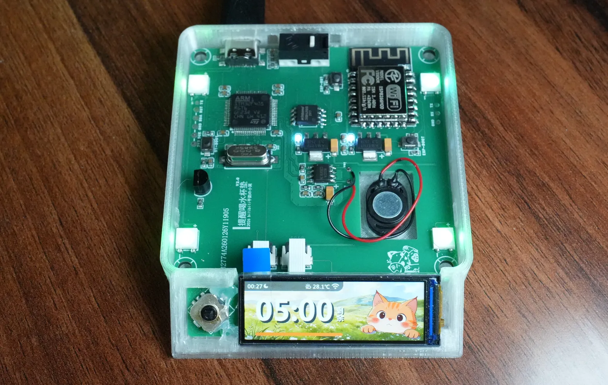

## 3.7、机械结构组装
在之前的基础上，安装顶盖：

<!-- 这是一张图片，ocr 内容为： -->
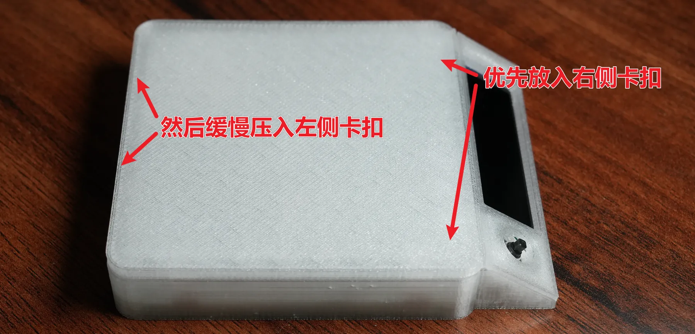

同时使用热熔胶粘贴前面板，并完成制作

# 4、系统架构浅析
## 4.1、硬件架构
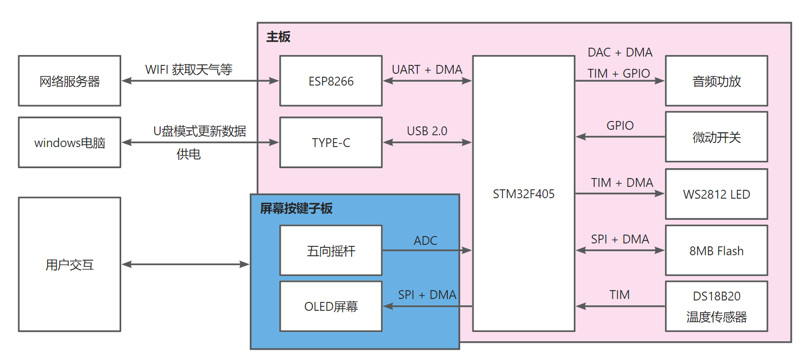

## 4.2、软件架构
主要使用技术栈：

+ FreeRTOS操作系统
+ LVGL V9.3图形库
+ FatFs文件系统
+ 前后端分离架构，GUI框架可直接在模拟器上运行，并无缝部署到硬件环境

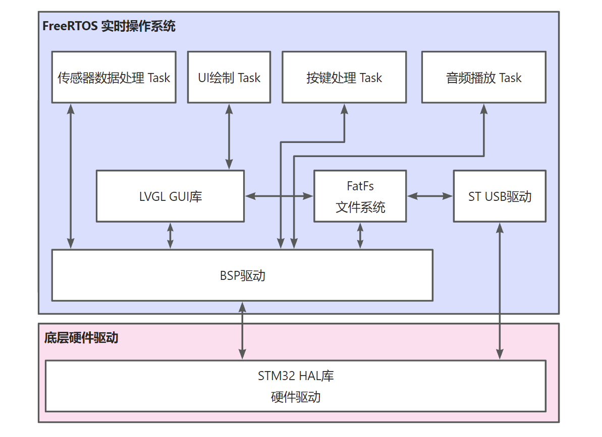

# 5、Q and A
## 5.1、有哪些素材可以自定义修改？
背景图片，三张表情图片，10条语音均可以进行替换。前者可用工程中附带的PS工程辅助导出相关图片，并通过LVGL Python图片工具导出对应的C数组，重新编译固件即可。后者可找任意AI配音网站，生成相应声音，并通过U盘模式替换即可。

## 5.2、不小心恢复出厂设置了咋办？
需要一台windows电脑，按上述**3.6章节**部分重新存入U盘文件即可

