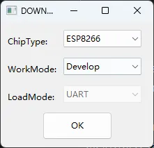
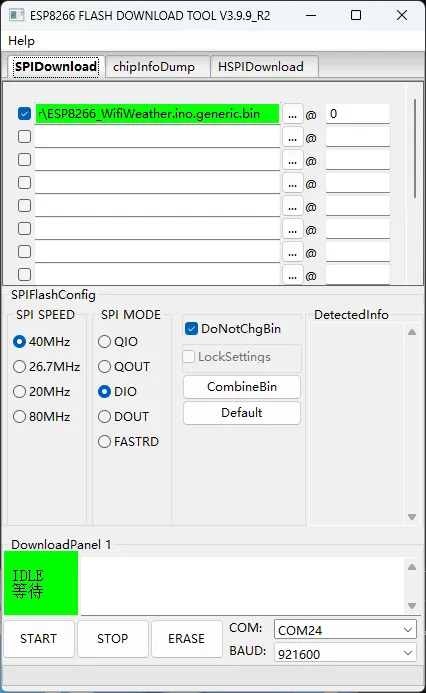

# 使用官方工具下载固件
PCB板使用USB TypeC接口供电，保持按住ESP-BOOT按键，然后短按一下ESP-RST按键，使ESP8266进入串口下载模式。

使用USB转串口工具连接 ESP8266下载串口，共如下三根线：
- GND
- TX
- RX

双击打开官方下载工具：


按如下选择模组型号



按需选择自己的串口，固件bin，其余选项和下图一致



选择正确后，点击START按钮，等待下载完成

# ESP8266代码说明

程序中使用了心知天气API来获取当前天气，使用阿里云API获取当前时间。

如二次开发，推荐替换心知天气密钥为自己申请的密钥：
```
#define WEATHER_API_KEY "SlpKSOC0woAJJEMbR"  // 替换为你的实际心知天气API密钥
```
程序开始运行后，需要通过串口发送三个参数到ESP8266：

- 位置：set_position:Beijing
- wifi名称：set_wifiname:tplink123456
- wifi密码：set_wifipasswd:400123456

ESP8266接收到参数之后，尝试自动连接WiFi，并获取心知天气信息，ESP8266日志如下：
```
Connecting to WiFi...
SSID: tplink123456
................
---WiFi connected:ok
---IP address:192.168.124.53
---Signal strength (RSSI):-55dBm
==================================
---nowtime:15:28:53
=== Current Weather Details ===
---City:北京
---Temperature:-4
Update Time: 2026-01-18T15:17:40+08:00
=== 3-Day Weather Forecast ===
---Date: 2026-01-18
---code_day:4
---Day:多云
---TemperatureLow:-11
---TemperatureHigh:-3
---Humidity:67
---end
---Date: 2026-01-19
---code_day:0
---Day:晴
---TemperatureLow:-13
---TemperatureHigh:-5
---Humidity:35
---end
---Date: 2026-01-20
---code_day:0
---Day:晴
---TemperatureLow:-13
---TemperatureHigh:-4
---Humidity:37
---end
=====================
```

这些日志信息会由STM32自动解析，并更新到GUI界面上