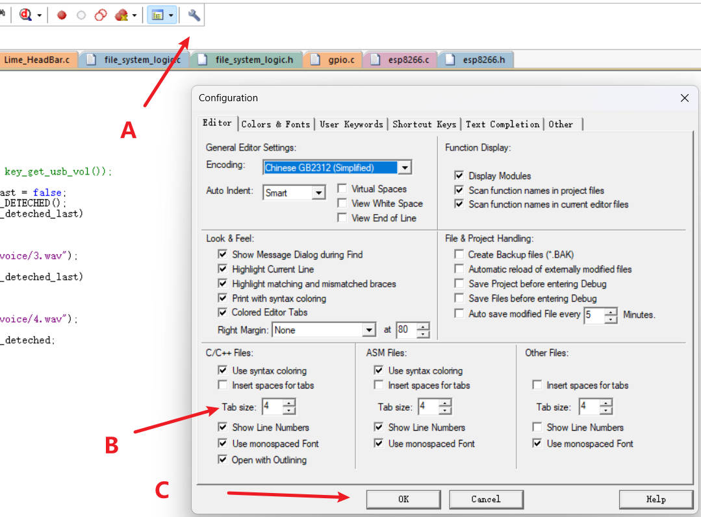

# 文件夹概览

- ESP8266_WIFI_WEATHER：ESP8266 Wifi天气小组件源码
- F405_BOOTLOADER：提醒喝水杯垫F405主板引导程序，使用Keil 5 MDK编写
- F405_CUP_MAT_V2：提醒喝水杯垫F405主板应用程序，使用Keil 5 MDK编写
- LVGL_SIMULATION：LVGL GUI界面代码以及对应的资源文件
- RELEASE_FIRMWARE：编译好的固件文件，可用于刷机或调试
- SIGNATURE_TOOL：应用程序签名工具，可为新编译完成的应用程序签名，以便bootloader识别
- UDISK_RESOURCES：提醒喝水杯垫主板U盘资源文件（需要自行拷贝到文件系统根目录中）

# MDK固件说明
## 主板固件阅读说明：
- 主板固件使用Keil 5 MDK编写，需要AC6编译器，推荐Keil版本V5.38及以上！
- 缩进为4，以方便阅读
- 主板固件源码中，有些地方可能有中文（LVGL界面相关），请注意不要修改文件编码格式（当前为UTF-8）



## 默认参数设置说明：
默认参数位于main.h中，目前有如下参数：
```C
#define GLOBAL_SETTING_FILE_PATH		"D:/setting.txt"
#define GLOBAL_DEFAULT_WIFI_NAME		"wifi_name"     //max length 64 bytes
#define GLOBAL_DEFAULT_WIFI_PASSWORD	"wifi_passord"  //max length 64 bytes
#define GLOBAL_DEFAULT_CITY_NAME		"BeiJing"       //max length 64 bytes
```

# 启动流程
1. 上电，运行bootloader程序
2. bootloader中尝试挂载文件系统，如果成功，则尝试读取更新固件
    - 如果没有更新固件，则校验已有固件，并跳转运行
    - 如果有更新固件，则下载更新固件，校验后覆盖已有固件，并跳转运行
3. 运行应用程序固件，启动wifi连接，连接成功后，尝试连接天气API，获取天气信息，并显示在屏幕上

# 固件更新说明
进入U盘模式后，可直接将已签名的待更新固件bin文件复制到U盘，复制完成后，断电，重新上电，杯垫亮黄灯，等待固件更新完成。
更新完成后，杯垫亮绿灯，此时会自动跳转固件并执行