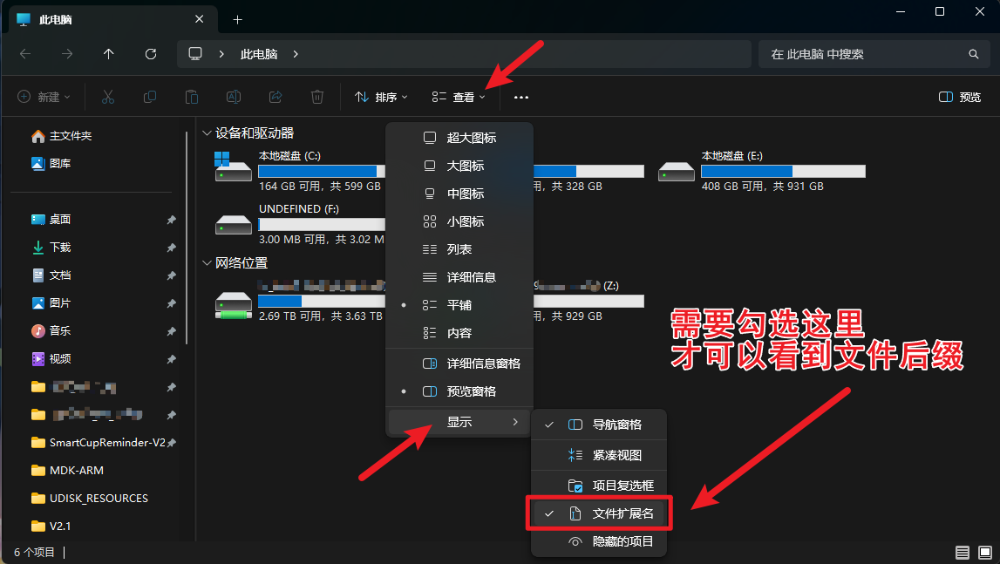
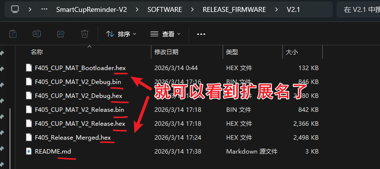

# 固件说明

> 以下所有应用程序均已签名，可被bootloader识别并自动更新

## V2.1固件列表：
> 初版，实现bootloader + application分离，实现自动更新功能

- F405_CUP_MAT_Bootloader.hex：提醒喝水杯垫F405主板引导程序
- F405_CUP_MAT_V2_Debug.bin：提醒喝水杯垫F405主板应用程序，包含调试信息，修改名字为update.bin后，粘贴入U盘，可被bootloader识别并自动更新
- F405_CUP_MAT_V2_Debug.hex：提醒喝水杯垫F405主板应用程序，包含调试信息
- F405_CUP_MAT_V2_Release.bin：提醒喝水杯垫F405主板应用程序，无调试信息，修改名字为update.bin后，粘贴入U盘，可被bootloader识别并自动更新
- F405_CUP_MAT_V2_Release.hex：提醒喝水杯垫F405主板应用程序，无调试信息
- F405_Release_Merged.hex：合并固件文件，包含提醒喝水杯垫F405主板应用程序和引导程序，用于工厂批量生产

## V2.0固件列表：
> 基础版本，无bootloader，已弃用

# 更新固件方法：
## 自动更新（V2.1及以上版本）：

> 注意！只适用于目前运行V2.1及以上版本固件的杯垫，如果您的杯垫目前运行V2.0版本，则需要手动更新固件

固件类型说明：
U盘自动更新只支持后缀为.bin的文件，类型包含两种，分别为Debug版和Release版。

- F405_CUP_MAT_V2_Debug.bin：包含调试信息（包含屏幕帧率，CPU占用率，串口日志等，可能会轻微影响性能，仅供调试使用）
- F405_CUP_MAT_V2_Release.bin：无调试信息（日常使用版）

自动更新流程：

1. 寻找心仪的固件（固件列表里后缀为.bin的文件，若您的电脑未显示文件后缀，请查看本文结尾），将其改名为update.bin，并记住位置 
2. 进入U盘模式，将需要更新的固件文件（update.bin）放入U盘根目录，待传输完成后，弹出U盘
3. 为系统重新上电，等待左上角LED灯点亮
4. 若LED为黄色，则成功识别到待更新固件，并开始尝试更新
5. 若更新成功，则LED灯变绿色，之后系统会自动运行新固件

## 手动更新（设备变砖了，或从旧V2.0版本升级到V2.1）：
如果设备更新失败，LED指示灯亮红灯，且无法进入U盘模式，则需要手动更新固件。
可参考最外层手册，3.5章节，为STM32烧录固件。
> 该方案最为稳定，也是最推荐的方案，但是需要额外准备一个ST-Link调试器。

连接ST-Link SWD接口到PCB板，推荐按如下方式接线：

左侧为ST-Link接口，右侧为PCB接口：
- 3V3   <---> 3V3
- SWCLK <---> SCK
- GND   <---> GND
- SWDIO <---> SDA
- RESET <---> RST

同时，建议断开USB供电，全板仅通过ST-Link提供STM32F4所需的3.3V电源

完成连接后，将ST-Link插入电脑，打开STM32CubeProgrammer软件，选择ST-Link模式，点击Connect按钮，选择下载的固件文件，点击Program按钮，等待下载完成。

# 附录
## 如何查看当前运行的固件版本
在杯垫设置页面最后一页（关于页面）右侧，有软件版本，后接版本号为当前运行的版本。

<!-- 这是一张图片，ocr 内容为： -->

## 如何让电脑显示文件扩展名
> 适用于win10和win11系统

<!-- 这是一张图片，ocr 内容为： -->

然后打开固件目录，就可以看到文件拓展名了:

<!-- 这是一张图片，ocr 内容为： -->

# 版权
bilibili 平韵の小窝 原创作品

仅限个人学习使用，严禁无授权的商业用途！
